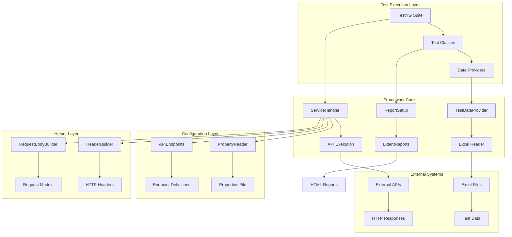
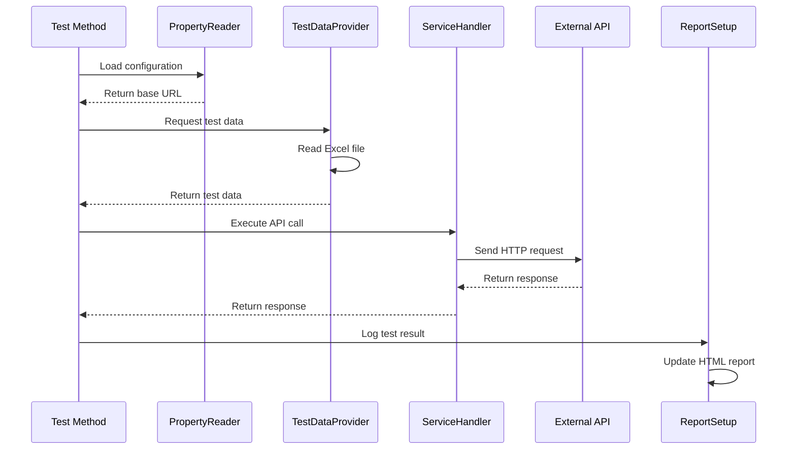
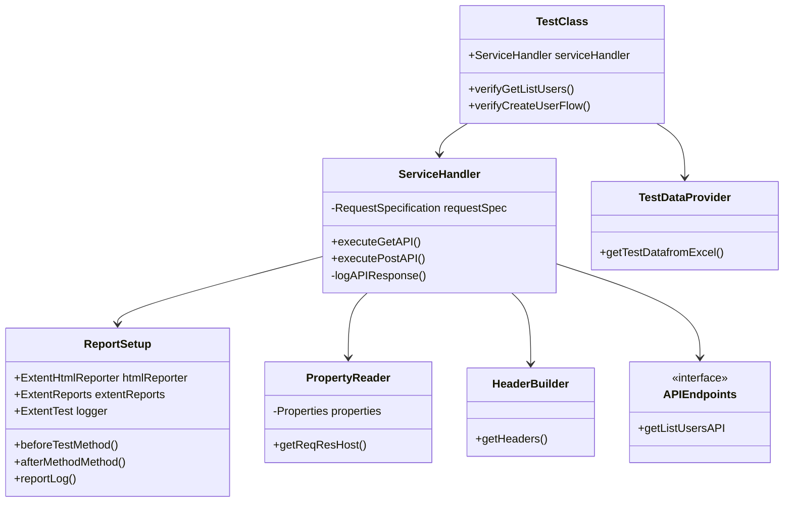

# Technical Architecture - REST Assured Framework

## 🏗️ System Architecture Overview



---

## 🔧 Component Architecture

### **1. Test Execution Layer**

#### **TestNG Suite (`testng.xml`)**
```xml
<suite name="All Test Suite">
    <listeners>
        <listener class-name="Utils.SuiteListener"></listener>
    </listeners>
    <test name="API Tests">
        <classes>
            <class name="getListUsers"></class>
        </classes>
    </test>
</suite>
```

#### **Test Classes**
- **Purpose**: Contains test methods with `@Test` annotations
- **Responsibilities**: 
  - Test scenario definition
  - Data provider integration
  - Assertion logic
  - Response validation

### **2. Framework Core**

#### **ServiceHandler**
```java
public class ServiceHandler extends ReportSetup {
    private final RequestSpecification requestSpec;
    
    public Response executeGetAPI(String endpoint, Map<String, String> headers, 
                                Map<String, String> queryParams) {
        // API execution logic
    }
    
    public Response executePostAPI(String endpoint, Map<String, String> headers, 
                                 Map<String, String> queryParams, String body) {
        // POST API execution logic
    }
}
```

**Key Features:**
- Centralized API execution
- Request/response logging
- Error handling
- Response validation

#### **ReportSetup**
```java
public class ReportSetup {
    public ExtentHtmlReporter htmlReporter;
    public static ExtentReports extentReports;
    public static ExtentTest logger;
    
    @BeforeTest
    public void beforeTestMethod() {
        // Report initialization
    }
    
    @AfterMethod
    public void afterMethodMethod(ITestResult result) {
        // Test result logging
    }
}
```

**Key Features:**
- HTML report generation
- Test status tracking
- Detailed logging
- Custom log messages

#### **TestDataProvider**
```java
public class TestDataProvider {
    @DataProvider(name = "TestData")
    public static Object[][] getTestDatafromExcel() {
        // Excel file reading logic
        // Returns 2D array of test data
    }
}
```

**Key Features:**
- Excel file integration
- Multiple test scenarios
- Reusable data providers
- Dynamic test data

### **3. Configuration Layer**

#### **PropertyReader**
```java
public class PropertyReader {
    private Properties properties;
    private final String propertyFilePath = "Properties.properties";
    
    String getReqResHost() {
        return properties.getProperty("req_res_service_testHost");
    }
}
```

**Key Features:**
- Environment-specific configs
- Centralized property management
- Easy maintenance
- Runtime configuration

#### **APIEndpoints**
```java
public interface APIEndpoints {
    String getListUsersAPI = "/api/users";
    // Additional endpoints can be added here
}
```

**Key Features:**
- Centralized endpoint definitions
- Easy endpoint management
- Version control friendly
- Clear API mapping

### **4. Helper Layer**

#### **HeaderBuilder**
```java
public class HeaderBuilder {
    public static Map<String,String> getHeaders() {
        Map<String,String> headers = new HashMap<>();
        headers.put("content-Type","application/json");
        headers.put("x-consumer-name","AG");
        headers.put("deviceId","OnePlus9");
        headers.put("platform","android");
        headers.put("x-api-key","reqres-free-v1");
        return headers;
    }
}
```

**Key Features:**
- Reusable header definitions
- Environment-specific headers
- Easy header management
- Consistent header usage

#### **RequestBodyBuilder**
```java
public class RequestBodyBuilder {
    public static String getCreateUserAPIRequest(String name, String job) {
        // Request body creation logic
    }
}
```

**Key Features:**
- Dynamic request body creation
- Parameterized requests
- JSON structure management
- Request validation

---

## 🔄 Data Flow Architecture



---

## 📊 Class Relationships



---

## 🎯 Design Patterns Implemented

### **1. Builder Pattern**
```java
@Builder
public class CreateUserRequest {
    private String name;
    private String job;
}

// Usage
CreateUserRequest request = CreateUserRequest.builder()
    .name("John")
    .job("Developer")
    .build();
```

### **2. Factory Pattern**
```java
public class HeaderBuilder {
    public static Map<String,String> getHeaders() {
        // Factory method for creating headers
    }
}
```

### **3. Data Provider Pattern**
```java
@DataProvider(name = "TestData")
public static Object[][] getTestDatafromExcel() {
    // Data provider implementation
}
```

### **4. Singleton Pattern (Implicit)**
```java
public class PropertyReader {
    private Properties properties;
    // Single instance of properties
}
```

---

## 🔧 Configuration Management

### **Properties Structure**
```properties
# src/main/resources/Properties.properties
req_res_service_testHost=https://reqres.in/
```

### **Environment-Specific Configs**
```java
// Support for multiple environments
public class PropertyReader {
    String getReqResHost() {
        return properties.getProperty("req_res_service_testHost");
    }
    
    // Can be extended for different environments
    String getStagingHost() {
        return properties.getProperty("staging_host");
    }
    
    String getProductionHost() {
        return properties.getProperty("production_host");
    }
}
```

---

## 📈 Performance Considerations

### **1. Memory Management**
- **Efficient Excel Reading**: Apache POI for large files
- **Response Caching**: Rest Assured built-in caching
- **Resource Cleanup**: Proper stream closing

### **2. Execution Optimization**
- **Parallel Execution**: TestNG parallel test execution
- **Data Provider Efficiency**: Optimized Excel reading
- **Report Generation**: Asynchronous report updates

### **3. Network Optimization**
- **Connection Pooling**: Rest Assured connection management
- **Timeout Configuration**: Configurable timeouts
- **Retry Logic**: Built-in retry mechanisms

---

## 🛡️ Error Handling Strategy

### **1. API Level Errors**
```java
public Response executeGetAPI(String endpoint, Map<String, String> headers, 
                            Map<String, String> queryParams) {
    try {
        Response response = requestSpec
            .headers(headers)
            .queryParams(queryParams)
            .get(endpoint);
        
        logAPIResponse("GET", endpoint, headers, queryParams, null, response);
        return response;
    } catch (Exception e) {
        reportLog("API Execution Failed: " + e.getMessage());
        throw e;
    }
}
```

### **2. Data Provider Errors**
```java
@DataProvider(name = "TestData")
public static Object[][] getTestDatafromExcel() throws IOException {
    try {
        // Excel reading logic
    } catch (IOException e) {
        throw new RuntimeException("Failed to read test data: " + e.getMessage());
    }
}
```

### **3. Configuration Errors**
```java
public PropertyReader() {
    try {
        reader = new BufferedReader(new FileReader(propertyFilePath));
        properties = new Properties();
        properties.load(reader);
    } catch (FileNotFoundException e) {
        throw new RuntimeException("Configuration.properties not found at " + propertyFilePath);
    }
}
```

---

## 🔮 Extensibility Points

### **1. New API Endpoints**
```java
public interface APIEndpoints {
    String getListUsersAPI = "/api/users";
    String createUserAPI = "/api/users";
    String updateUserAPI = "/api/users/{id}";
    String deleteUserAPI = "/api/users/{id}";
}
```

### **2. New HTTP Methods**
```java
public class ServiceHandler {
    public Response executePutAPI(String endpoint, Map<String, String> headers, 
                                Map<String, String> queryParams, String body) {
        // PUT implementation
    }
    
    public Response executeDeleteAPI(String endpoint, Map<String, String> headers, 
                                   Map<String, String> queryParams) {
        // DELETE implementation
    }
}
```

### **3. New Data Sources**
```java
public class TestDataProvider {
    @DataProvider(name = "DatabaseData")
    public static Object[][] getTestDataFromDatabase() {
        // Database integration
    }
    
    @DataProvider(name = "JSONData")
    public static Object[][] getTestDataFromJSON() {
        // JSON file integration
    }
}
```

---

## 📝 Technical Specifications

| Component | Technology | Version | Purpose |
|-----------|------------|---------|---------|
| **Language** | Java | 11 | Core programming language |
| **Build Tool** | Gradle | Latest | Dependency management |
| **Test Framework** | TestNG | 7.9.0 | Test execution |
| **HTTP Client** | Rest Assured | 4.5.0 | API testing |
| **Reporting** | ExtentReports | 4.0.4 | HTML reporting |
| **Data Handling** | Apache POI | 5.2.2 | Excel file processing |
| **JSON Processing** | Jackson | 2.15.2 | JSON serialization |
| **Code Generation** | Lombok | 1.18.22 | Boilerplate reduction |

---

*This technical architecture provides a solid foundation for scalable, maintainable API automation with clear separation of concerns and extensible design patterns.* 