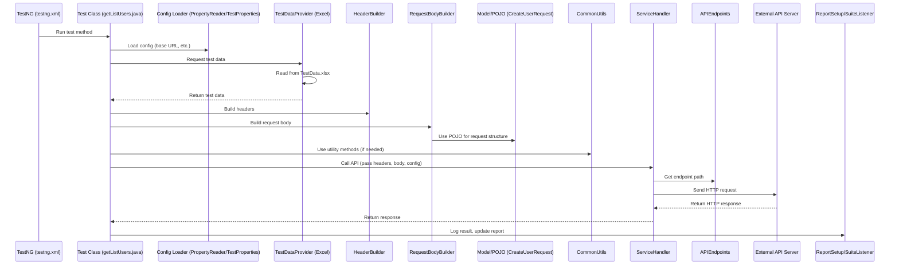

# Framework Architecture

## Sequence Diagram

## Component Explanations

- **TestNG (testng.xml):** Entry point for the test suite, defines which tests to run and configuration.
- **Test Class:** Contains test methods, uses `@Test` and `@DataProvider` annotations.
- **Config Loader:** Loads environment and endpoint details before the test.
- **TestDataProvider:** Reads test data from Excel using Apache POI, provides it to test methods.
- **HeaderBuilder/RequestBodyBuilder:** Helper classes to construct HTTP headers and request bodies.
- **Model/POJO:** Represents the structure of request payloads.
- **CommonUtils:** General-purpose utility methods used in the test flow.
- **ServiceHandler:** Centralizes the logic for making API calls, using endpoint info from `APIEndpoints`.
- **APIEndpoints:** Centralized location for all endpoint paths (URLs).
- **External API Server:** The actual API under test.
- **ReportSetup/SuiteListener:** Handles logging, reporting, and hooks for test events. 